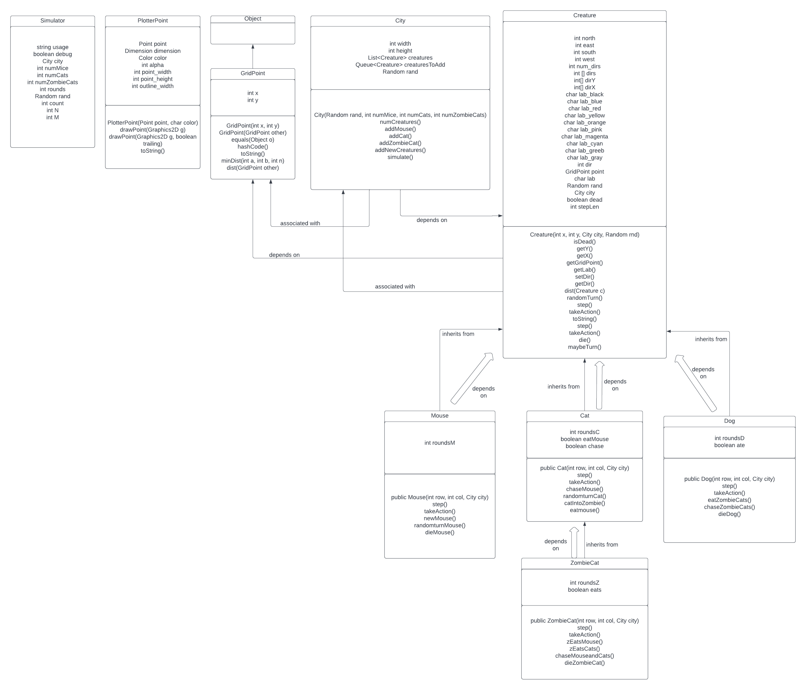

# OOP Design Document

## Overview

## Simulator
Simulator class has string usage, boolean debug, City city, int numMice, int nUME.ATc, int numzombiecats, int rounds, Random rand, Int count, and int M. 
This class has the main method for the simulation of the program.

## PlotterPoint 
PlotterPoint has variables Point point, Dimension dimension, Color color, int alpha, int point_width, int point_height, and int outline_width. It also has a PlotterPoint, drawPoint, and toString methods. 
This class takes care of the plotting and plots all the creatures in the city. 

## GridPoint
GridPoint has int x and int y as variables, then it has GridPoint(int x, int y), GridPoint(GridPoint other), equals(Object o), hashCode(), toString(), minDist(int a, int b, int n), and dist(GridPoint other). 
This class implements a row and column that is be used as a key in a map. It has the grid points for all the creatures, and you can access the grid points of all the creatures through this class.

## City
City is associated with the GirdPoint. It has int width, int height, list<Creature> creatures, queue<creature> creaturesToAdd, and Random rand. It has City (Random rand, int numMice, int numCats, int numZombieCats), numcreatures(), addmouse(), addcat(), addZombieCat(), addNewCreatures() and simulate() methods. 
This class represents the city in which all the creatures live in. 

## Creature 
The Creature class is an abstract class.
It has int north, int east, int west, int south, int num_dirs, int[] dirs, int[]dirY, int[]dirX, char lab_black, char lab_blue, char lab_red, char lab_yellow, char lab_orange, char lab_pink, char lab_magenta, char lab_green, char lab_gray, int dir, GridPoint point, char lab, Random ran, City city, boolean dead, and int stepLen. It has Creature(int x, int y, City city, Random ind), isDead(), getY(), getX(), getGridPoint(), getLab(), setDir(), getDir(), dist(Creature c), randomTurn(), step(), takeAction(), and toString() methods. 

Creature class creates the creatures and has the main functions that all the creatures share. Creature class is associated with the City class, and depends on the GridPoint class. City class depends on the Creature class.

## Mice
Mouse Class extends the Creature Class, so it inherits everything from its parent class. It also has the Mouse() constructor and several methods such as step(), takeAction(), dieMouse() and more, along with a int roundsM variable to keep track of the rounds of the mice. 

## Cats
Cat Class extends the Creature Class, so it inherits everything from its parent class. It also has the Cat() constructor and methods such as step(), takeAction(), chaseMouse(), catIntoZombie() and more, along with a int roundsC variable to keep track of the rounds of the cats. The cats chases and eats the mouse.

## ZombieCats
ZombieCat extends the Cat class, so it inherits everything from the Cat class. It also has the ZombieCat() constructor and methods such as step(), takeAction(), zEatsMouse(), zEatsCats() and more, along with the int roundsZ variable to keep track of the rounds of the zombiecats. The ZombieCat chases both mouse and cat, and it eats the mouse. When it eats the cat, the cat turns into ZombieCat.

## Dogs
Dog is the new creature that I created for the level 4. Dog class extends the Creature class and it has the Dog() constructor. It has methods such as step(), takeAction(), eatZombieCats(), chaseZombieCats() and dieDog(), along with the int roundsD variable to keep track of the rounds of the dogs. The Dog only chases and eats the ZombieCats.
