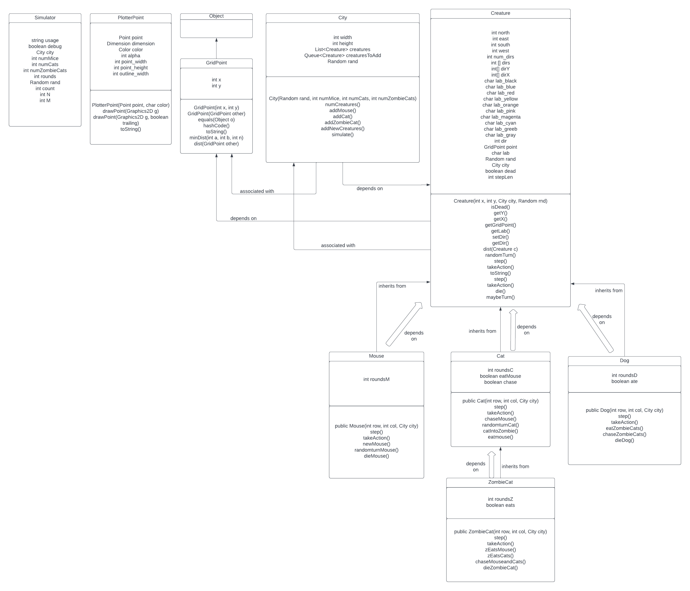

# Pursuit Game

## Overview
I designed an exciting pursuit (chase) game featuring a variety of animals, each driven by their instincts to chase and capture their prey. Should they fail to achieve this objective within a specified time, various consequences come into play, including the risk of death leading to a reduction in the population. The game's mechanics involve different animals pursuing specific targets, creating a dynamic and engaging ecosystem. For instance, cats relentlessly chase after mice, while the mysterious "Zombie" Cat pursues both cats and mice, capable of consuming both as its prey.

Adding further depth to the gameplay, I introduced a fascinating new creature called the "Dog". At the beginning of the game, a pack of 15 dogs, having a distinct Magenta color, becomes an integral part of the virtual world. The dogs' primary focus revolves around the "Zombie" Cats, as they dedicate their efforts to chasing and consuming these mysterious cats. When the dogs are in pursuit, they undergo a visual transformation, emanating an eye-catching orange color to signify their heightened state of alertness and determination. This addition enhances the gameplay's complexity. Strategic decision-making becomes essential while the dogs are in this pursuit game. To effectively chase the elusive "Zombie" Cat, the dog must be within a 10-gridpoint radius of its target. 

# Design Document

## Simulator
The Simulator class comprises several variables, including string usage, boolean debug, City city, int numMice, int nUME.ATc, int numzombiecats, int rounds, Random rand, Int count, and int M. This class serves as the entry point for the program's simulation.

## PlotterPoint 
PlotterPoint contains variables such as Point point, Dimension dimension, Color color, int alpha, int point_width, int point_height, and int outline_width. It also provides methods like PlotterPoint, drawPoint, and toString. This class handles the plotting of all creatures within the city.

## GridPoint
The GridPoint class features int x and int y variables. It includes constructors GridPoint(int x, int y) and GridPoint(GridPoint other), along with methods like equals(Object o), hashCode(), toString(), minDist(int a, int b, int n), and dist(GridPoint other). GridPoint is utilized as a key in a map, storing the grid points for all creatures in the simulation.

## City
City is linked with GridPoint and contains variables int width, int height, list<Creature> creatures, queue<creature> creaturesToAdd, and Random rand. City includes constructors like City(Random rand, int numMice, int numCats, int numZombieCats), numcreatures(), addmouse(), addcat(), addZombieCat(), addNewCreatures(), and simulate(). This class represents the virtual city where all creatures reside.

## Creature 
The Creature class serves as an abstract class, providing common functionality shared among all creatures. It holds int north, int east, int west, int south, int num_dirs, int[] dirs, int[]dirY, int[]dirX, char lab_black, char lab_blue, char lab_red, char lab_yellow, char lab_orange, char lab_pink, char lab_magenta, char lab_green, char lab_gray, int dir, GridPoint point, char lab, Random ran, City city, boolean dead, and int stepLen. Creature includes methods such as Creature(int x, int y, City city, Random ind), isDead(), getY(), getX(), getGridPoint(), getLab(), setDir(), getDir(), dist(Creature c), randomTurn(), step(), takeAction(), and toString().

## Mice
Mouse is a subclass of the Creature class, inheriting all attributes and methods. It has its own constructor Mouse() and various additional methods, including step(), takeAction(), dieMouse(), and more. The class also includes an int roundsM variable to keep track of mouse-specific rounds.

## Cats
Cat is another subclass of the Creature class, inheriting all attributes and methods. It has its constructor Cat() and methods like step(), takeAction(), chaseMouse(), catIntoZombie(), and more. The class features an int roundsC variable to track cat-specific rounds. Cats chase and eat mice in the simulation.

## ZombieCats
ZombieCat extends the Cat class, inheriting its properties. It has its constructor ZombieCat() and methods such as step(), takeAction(), zEatsMouse(), zEatsCats(), and more. The class includes an int roundsZ variable to monitor rounds specific to zombie cats. ZombieCats chase both mice and cats, eating mice. When they eat a cat, the cat becomes a ZombieCat.

## Dogs
Dog is a new creature introduced. It extends the Creature class and has its constructor Dog(). The class provides methods like step(), takeAction(), eatZombieCats(), chaseZombieCats(), and dieDog(). It includes an int roundsD variable to track dog-specific rounds. Dogs exclusively chase and eat ZombieCats.
